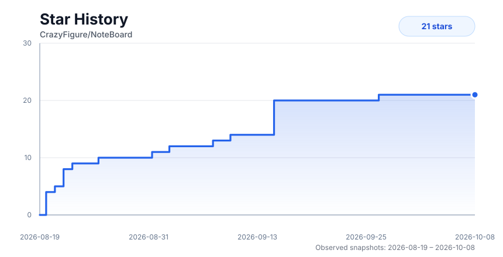

<div align="center">
  

  # NoteBoard

  **Windows 桌面笔记 + 画板 + 多维表格 + 知识工作台**

  像记事本一样随手打开任意文本文件，像 Typora 一样写 Markdown，像飞书一样整理多维表格，像白板一样画图，像 XMind 一样梳理脑图。

  [](LICENSE)
  
  
</div>

---

## 概览

NoteBoard 是一款轻量、现代化的 Windows 桌面效率工具，集 Markdown 笔记、多维表格、声明式信息图、思维导图、白板绘图、代码配置编辑与图片预览于一体。

坚持本地优先（Local-First）与文件优先理念：无强制工作区绑定、无强制云端同步。双击即开，即开即写，数据完全由你掌控。

## 核心功能

- **原生富文本笔记**
  - `.nbdoc` 保留文字颜色、高亮、段落对齐、表格底色、合并关系及行高列宽，专注可视化编辑。
  - 随时导出不含 NoteBoard 样式注释的 Markdown；复杂表格使用标准 HTML 保留内容。
  - 支持标题折叠与整节拖动、表格行列排序和可撤销的结构操作。本地图片仍使用外部文件引用。

- **Markdown 富文本与源码双模笔记**
  - 基于 TipTap 3 与 CodeMirror 6，所见即所得与源码编辑模式无缝切换。
  - 支持 KaTeX 科学公式、Mermaid 与 PlantUML 图表、Infographic 信息图嵌入、GitHub Alerts 提示块。
  - 斜杠命令快捷插入（`/`）、悬浮气泡工具栏、块级拖拽重排与文档大纲实时联动。

- **多维表格（Bitable）**
  - 支持 `.bitable` 与 `.table` 文件，表格（Grid）与看板（Kanban）视图自由切换。
  - 丰富字段类型：文本、多行文本（支持 Markdown 富文本编辑）、数字、单选、多选、日期、时间、日期时间、复选框等。
  - 自研日期时间选择器、多字段联合排序、按列分组展示与折叠、记录详情抽屉侧边栏。
  - 流畅拖拽体验：表头拖拽换列、行拖拽换序、看板泳道与卡片跨分组拖拽、视图 Tab 拖拽重排。

- **Infographic 现代化信息图**
  - 独立 `.infographic` / `.ig` 文件分屏实时预览编辑器，支持在 Markdown 笔记中直接嵌入。
  - 开箱即用预设模板：核心指标看板、项目里程碑时间线、业务流转步骤图、用户转化漏斗、方案对比表、四象限优先级矩阵与统计图表。
  - 声明式轻量配置，自动适配当前主题明暗风格。

- **思维导图与幕布大纲**
  - 支持 `.mindmap`、`.xmind`（XMind 格式兼容导入导出）与 `.mm`。
  - 脑图可视化与层级大纲双向实时同步。
  - 支持整树拖拽与落位指示、节点图标选择器、备注说明与图片附件。

- **自由手绘白板与架构设计**
  - **Excalidraw 白板**：支持 `.excalidraw`、`.board`、`.canvas`，自由手绘涂鸦、流程草图与图形素材库。
  - **Draw.io 架构图**：集成 Draw.io 原生设计能力，支持 `.drawio` 与 `.dio` 专业架构图与系统流程设计。

- **代码与配置文本编辑**
  - 支持 `.txt`、`.sql`、`.json`、`.yaml`、`.yml`、`.xml`、`.log`、`.ini`、`.conf` 等格式。
  - 语法高亮、实时语法校验（Lint）、代码折叠与格式化。

- **图片查看与图表统一导出**
  - 图片查看器：支持 PNG、JPG、JPEG、WebP、SVG、GIF、AVIF、BMP、ICO 等格式直接预览与缩放。
  - 统一图表导出菜单：Mermaid、PlantUML 与 Infographic 均支持一键复制或导出为高清 SVG / PNG 图片。

## 桌面特性

| 特性 | 说明 |
|---|---|
| **文件优先** | 双击即开、右键“用 NoteBoard 打开”、文件拖拽入窗口直接查看或编辑。 |
| **多窗口与标签页** | 多窗口独立并行，标签页可自由拆分并在新窗口中打开，支持快捷切换。 |
| **智能目录联动** | 资源管理器动态跟随当前激活标签页所在目录，切换标签自动切换目录视图。 |
| **双侧灵活收起** | 编辑区左右两侧均配备悬浮折叠控件，一键展开或收起资源目录与文档大纲。 |
| **草稿与暂存** | 临时笔记快速记录，未命名草稿自动暂存，关闭与异常退出安全防丢。 |
| **精心调色主题** | 提供 `晨光`、`琥珀` 与 `墨夜` 三套主题，经过 WCAG AA 对比度优化，支持跟随系统明暗自动切换。 |
| **排版自由调节** | 字体族、字号、行高及内容最大宽度均支持个性化调整；提供可选免安装字体包（JetBrains Mono / Maple Mono）。 |
| **智能保存策略** | 原生笔记、Markdown、画板、多维表格与思维导图支持自动保存；代码及配置文件支持手动保存与防丢拦截。 |
| **高性能大文档优化** | 具备分段虚拟滚动、视口懒渲染与 Worker 分段解析机制，平稳处理长篇文档与海量数据。 |

## 技术栈

Tauri v2 · React 19 · TypeScript · Vite · Tailwind CSS v4 · Zustand · TipTap 3 · CodeMirror 6 · Excalidraw · Mermaid · KaTeX · @dnd-kit · @tanstack/react-virtual

## 快速开始

> 环境要求：Node.js ≥ 20、pnpm ≥ 9、Rust stable、Windows 10 1809+（含 WebView2 Runtime）

```bash
# 安装依赖
pnpm install

# 启动开发环境
pnpm tauri dev

# 构建生产安装包（NSIS）
pnpm tauri build
```

## 开源协议

NoteBoard 遵循 **GPL-3.0-only** 开源许可协议。

## Star 走势

[](https://github.com/CrazyFigure/NoteBoard/stargazers)
